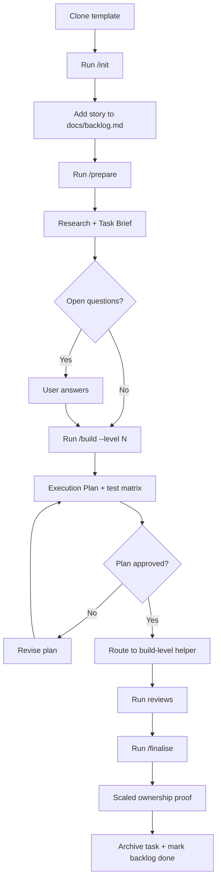

# Method

> AI-assisted workflow control-plane template for structured software delivery with tasks, reviews, and understanding gates.

An AI-assisted project template for Claude Code and Codex. It keeps active work in `tasks/current.md`, separates preparation from execution, lets the human choose the degree of AI authorship with explicit build levels, and scales the end-of-task ownership proof to the actual risk of the change.

## Initialize a Project

Run `/init` from Claude Code or Codex after cloning this template into the repository that will use the control plane.

`/init` begins by running `python3 scripts/ensure_control_plane.py`. If the control plane is already configured, it stops cleanly. Otherwise it asks for the project name, short description, and primary stack; fills those values into `CLAUDE.md` and `README.md`; configures `git config core.hooksPath .githooks`; lets you keep or remove domain skills and specialist agents; reruns validation; and then points you to `/prepare`.

After `/init`, fill in the remaining project-specific context:

1. Review `CLAUDE.md` and add conventions or architecture notes the skill could not infer.
2. Brainstorm your project requirements in a chat conversation, then use the `product-backlog-manager` agent to turn them into well-structured user stories in `docs/backlog.md`.
3. Review `.claude/rules/` and adjust or add project-specific guardrails.
4. Launch Claude Code or Codex and invoke `/prepare`.

## Runtime Layout

| Directory | Platform | Purpose |
|---|---|---|
| `.claude/skills/` | Claude Code | Workflow skills (SKILL.md files) |
| `.claude/agents/` | Claude Code | Specialist agent prompts (markdown) |
| `.claude/rules/` | Claude Code | Glob-matched behavioral guardrails |
| `.claude/hooks/` | Claude Code | Notification hooks |
| `.agents/skills/` | Codex | Workflow skills (SKILL.md + openai.yaml) |
| `.codex/agents/` | Codex | Subagent definitions (TOML) |
| `scripts/` | Both | Shared deterministic helpers used by skills and git hooks |
| `.githooks/` | Both | Git hook enforcement (pre-push gate, post-commit reminder) |

## Invoking Skills

| Platform | How to invoke |
|---|---|
| Claude Code | Type `/init`, `/prepare`, `/build --level 1`, `/finalise`, or `/test-me` |
| Codex | Type `/init`, `/prepare`, `/build --level 1`, `/finalise`, or `/test-me` |

## Workflow At A Glance

The backlog remains the single intake point for work. Every task starts as a story in `docs/backlog.md`, becomes active in `tasks/current.md`, moves through research and a Task Brief, then uses `/build` to turn that brief into an execution plan and route work through the chosen build level.



## User-Facing Skills

| Skill | Purpose |
|---|---|
| `/init` | One-time setup: populate identity files, configure hooks, and review optional domain assets. |
| `/prepare` | Activate the next or selected story, run research, and capture Work Configuration plus a runner-neutral Task Brief. |
| `/build --level N [--profile balanced]` | Draft the execution plan, validate level/profile compatibility, route work through the selected build-level helper, and coordinate review. |
| `/finalise` | Scale the ownership proof to the selected level and risk, archive the task, and reset the active task note. |
| `/test-me` | Run a direct ownership-proof session when a rehearsal or explicit interrogation is needed outside normal finalisation. |

## Build Levels

| Level | Alias | Purpose | Expected behavior |
|---|---|---|---|
| `1` | `coach` | Keep the human as primary author | Ask first, escalate help gradually, and avoid full first drafts. |
| `2` | `scaffold` | Reduce blank-page friction without taking over authorship | Provide structure, pseudocode, outlines, and edge-case framing, then review the human's work. |
| `3` | `pair` | Co-drive in reviewable seams | Propose one small seam at a time, explain intent first, and pause for approval between seams. |
| `4` | `delegate` | Explicit high-autonomy execution | Produce larger patches or drafts efficiently while keeping acceptance mapping and reviewability explicit. |

## Build Profiles And Compatibility

| Profile | Intent | Planning expectation |
|---|---|---|
| `cheap` | low-cost worker | Needs tighter seams and a more explicit execution plan. |
| `balanced` | default general worker | Works with moderate structure. |
| `strong` | top reasoning worker | Can operate from looser but still auditable plans. |

| Level | Allowed profiles |
|---|---|
| `1` | `cheap`, `balanced`, `strong` |
| `2` | `cheap`, `balanced`, `strong` |
| `3` | `balanced`, `strong` |
| `4` | `balanced`, `strong` |

If an unsupported combination is chosen, `/build` must stop before implementation begins.

## Task Brief, Design Pack, And Execution Plan

`/prepare` should usually stop at a Task Brief. That brief records the goal, work type, deliverable type, constraints, risks, likely files, open ambiguities, and level-fit or runner-fit notes.

`/build` turns that Task Brief into the execution plan after the human chooses a build level. When the level and profile were chosen early, `/prepare` may pre-fill more of the Build Configuration, but it should still avoid silently taking that decision away from the human.

Design artifacts are optional. Include them when a task crosses boundaries, has meaningful workflow branching, introduces a significant design tradeoff, or would benefit from a handoff-quality artifact. Keep the artifact set as small as possible:

- sequence diagram
- activity diagram
- component or system diagram
- ADR
- implementation brief
- acceptance-criteria mapping


## Example Flows

### Implementation Examples

1. Level 1: Add a validation guard where the human writes the first branch and the agent only escalates from hints to a tiny patch if needed.
2. Level 2: Outline a parser refactor with invariants and edge cases, then let the human write the production code.
3. Level 3: Propose one test group or one error-handling seam at a time, explain the tradeoff, and pause after each patch for review.
4. Level 4: Generate a repetitive migration or broad doc refresh quickly, while keeping acceptance-criteria mapping explicit for review.

### Research Examples

1. Level 1: Challenge a recommendation memo with questions and counterexamples before offering structure.
2. Level 2: Provide a section outline, evidence buckets, and comparison frame for a proposal while the human writes the prose.
3. Level 3: Draft one proposal section at a time with intent-before-content and approval pauses between sections.
4. Level 4: Produce a first-draft research summary quickly, then rely on review and the scaled ownership proof to confirm understanding.

### Design-Pack Examples

1. `/prepare` stops at the Task Brief for a small, local bugfix with no cross-boundary impact.
2. `/prepare` includes a sequence diagram and implementation brief when a task changes branching workflow behavior across multiple skills.

## Internal Helpers

| Skill | Purpose |
|---|---|
| `research` | Scan the repo for relevant files, patterns, constraints, open questions, and proposed answers. |
| `plan-task` | Turn the Task Brief plus build configuration into the level-aware execution plan. |
| `test-matrix` | Define the explicit verification plan for the approved work. |
| `checkpoint` | Reconcile `tasks/current.md` with the actual repo state during implementation. |
| `build-level-1` to `build-level-4` | Execute the approved plan according to the selected authorship level. |
| `update-references` | Refresh `docs/scriptReferences.md` from the current scripts, queries, and handlers. |
| `test-me` | Run the ownership proof and record understanding, gaps, and remediation. |
| `follow-up-triage` | Turn accepted risks, deferred findings, and override debt into visible follow-up work. |
| `compound` | Capture reusable lessons from the completed task into `docs/learnings/`. |
| `compound-refresh` | Periodically review and maintain the learnings knowledge base. |

## Key Principles

- `tasks/current.md` is the single source of truth for the active task.
- The human chooses the build level explicitly.
- Research-only tasks still use Levels 1 to 4, but the prompts should use research or drafting language rather than implementation-mode language when the deliverable is not code.
- `/prepare` captures the Task Brief; `/build` materializes the execution plan.
- Ownership evidence should be gathered during work so `/finalise` can focus the proof on what still matters.
- Reviews still happen before finalisation, even for higher-autonomy build levels.


## Project Structure

```text
.
|-- AGENTS.md                  # Repo agent policy and Codex entry point
|-- CLAUDE.md                  # Project memory for Claude Code
|-- README.md                  # This file
|-- docs/
|   |-- backlog.md             # Prioritised user stories
|   |-- learnings/             # Compound learning knowledge base
|   |-- scriptReferences.md    # Auto-generated code inventory
|   `-- decisions/
|       `-- 000-template.md    # Architecture Decision Record template
|-- tasks/
|   |-- current-template.md    # Template for tasks/current.md
|   |-- current.md             # Active task note and workflow state
|   `-- completed/             # Archive of finished task notes
|-- issues/                    # Tracked issues and bugs
|-- scripts/
|   |-- ensure_control_plane.py
|   |-- check_understanding_gate.py
|   `-- record_understanding.py
|-- .githooks/
|   |-- post-commit
|   `-- pre-push
|-- .agents/
|   `-- skills/
`-- .claude/
    |-- agents/
    |-- hooks/
    |-- rules/
    `-- skills/
```

