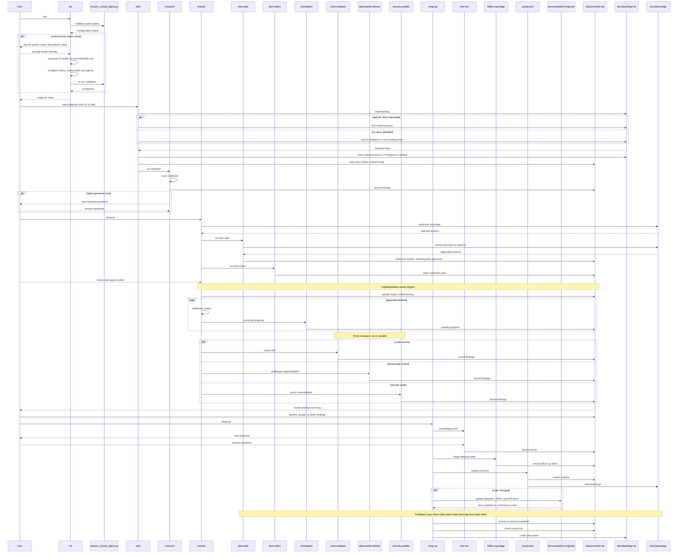

# [Project Name]

> [Short description]

An AI-assisted project template for Claude Code and Codex. It uses repo skills to make workflow steps repeatable, keeps active work in `tasks/current.md`, requires an understanding gate before wrap-up so implementation is explained and learned, and captures reusable lessons through a compound learning loop.

## Initialize a Project

Run `/init` from Claude Code or Codex after cloning this template into the repository that will use the control plane.

`/init` begins by running `python3 scripts/ensure_control_plane.py`. If the control plane is already configured, it stops cleanly. Otherwise it asks for the project name, short description, and primary stack; fills those values into `CLAUDE.md` and `README.md`; configures `git config core.hooksPath .githooks`; lets you keep or remove domain skills and specialist agents; reruns validation; and then points you to `/start`.

After `/init`, fill in the remaining project-specific context:

1. Review `CLAUDE.md` and add conventions or architecture notes the skill could not infer.
2. Brainstorm your project requirements in a chat conversation, then use the `product-backlog-manager` agent to turn them into well-structured user stories in `docs/backlog.md`.
3. Review `.claude/rules/` and adjust or add project-specific guardrails.
4. Launch Claude Code or Codex and invoke `/start`.

## Runtime Layout

| Directory | Platform | Purpose |
|---|---|---|
| `.claude/skills/` | Claude Code | Workflow skills (SKILL.md files) |
| `.claude/agents/` | Claude Code | Specialist agent prompts (markdown) |
| `.claude/rules/` | Claude Code | Glob-matched behavioral guardrails |
| `.claude/hooks/` | Claude Code | Notification hooks |
| `.agents/skills/` | Codex | Workflow skills (SKILL.md + openai.yaml) |
| `.codex/agents/` | Codex | Subagent definitions (TOML) |
| `scripts/` | Both | Shared deterministic helpers used by skills and git hooks |
| `.githooks/` | Both | Git hook enforcement (pre-push gate, post-commit reminder) |

### Invoking Skills

| Platform | How to invoke |
|---|---|
| Claude Code | Type the skill name as a slash command: `/init`, `/start`, `/resume`, `/wrap-up` |
| Codex | Type the skill name as a slash command: `/init`, `/start`, `/resume`, `/wrap-up` |

## How You Use the Workflow

As a human, you only need to call **four skills** directly. Everything else is orchestrated automatically.

```text
You call:              What happens automatically:
─────────              ──────────────────────────
/init            →     One-time setup: populates CLAUDE.md, configures hooks,
                       validates the control plane and reviews domain skills
                       and agents
                       ↓
/start           →     Activates story, runs research, stops for your input
                       ↓
/resume          →     Drafts plan (waits for approval), implements, runs
                       code-reviewer + adversarial-referee + security-auditor,
                       stops for your review disposition
                       ↓
/wrap-up         →     Runs knowledge proof, triages debt, captures lessons,
                       updates docs when code changed, archives task, resets
                       for next story
```

**Your decision points** — the workflow pauses and waits for you at these moments:

1. After research, if open questions remain — answer or guide
2. After the plan is drafted — approve, revise, or reject
3. After review findings are recorded — fix, accept, or defer each finding
4. During knowledge proof — answer questions about your implementation
5. If the knowledge proof fails — remediate or record an override

Everything between these points runs autonomously.

## Workflow

The workflow revolves around `docs/backlog.md`. The backlog is the single intake point for all work. Every task starts as a user story there before it becomes active.

### Populating the Backlog

User stories can be generated through any chat interface. Use a brainstorming conversation to think through requirements, then paste the resulting stories into `docs/backlog.md` using the standard template:

```md
### US-NNN: [Story title]

**As a** [user type]
**I want** [capability]
**So that** [benefit]

**Acceptance criteria:**
- [ ] [criterion]
```

Stories are prioritised top-to-bottom in the Backlog section. When you are ready to start work, use `/start`.

- If you just say `/start`, the skill activates the current in-progress story or the next unchecked backlog story.
- If you want a specific story, say `/start` and include the story ID or title. The skill will select that backlog item and move it into `## In Progress` for you.

The same lifecycle then follows: activate, research, clarify, plan, implement, review, verify understanding, capture lessons, and wrap up.

### Task Lifecycle

```mermaid
flowchart TD
    A["Clone template into the target repo"] --> B["Run /init<br/>(validate control plane,<br/>set project identity,<br/>configure hooks,<br/>review skills and agents)"]
    B --> C["Brainstorm / rubber-ducky<br/>in any chat interface"]
    C --> D["Add story to docs/backlog.md"]
    D --> E{"How to start / choose a story?"}
    E -- "/start" --> F["Select in-progress or next<br/>backlog story"]
    E -- "/start + story ID or title" --> G["Select matching story<br/>from docs/backlog.md"]
    F --> H["Move selected story<br/>to In Progress if needed"]
    G --> H
    H --> I["Copy story into tasks/current.md"]
    I --> J["Run research and record open questions"]
    J --> K{"Unresolved<br/>questions?"}
    K -- Yes --> L["User answers or guides<br/>via /resume"]
    K -- No --> M["/resume checks<br/>docs/learnings/ then<br/>drafts plan + verification plan"]
    L --> M
    M --> N{"Plan approved?"}
    N -- No --> O["User revises or rejects<br/>via /resume"]
    O --> M
    N -- Yes --> P["/resume implements<br/>approved phases"]
    P --> Q["checkpoint updates<br/>state and progress"]
    Q --> R{"Implementation<br/>complete?"}
    R -- No --> P
    R -- Yes --> S["Three review agents run<br/>in parallel"]
    S --> T{"Findings resolved<br/>or dispositioned?"}
    T -- No --> U["User fixes, accepts,<br/>or defers findings"]
    U --> P
    T -- Yes --> V["/wrap-up runs<br/>test-me / gate"]
    V --> W{"Pass or override<br/>recorded?"}
    W -- No --> X["Remediation loop"]
    X --> V
    W -- Yes --> Y["/wrap-up runs<br/>follow-up-triage + compound"]
    Y --> Z["documentation-engineer updates<br/>diagrams / ADRs / API docs<br/>when code changed"]
    Z --> AA["Archive task and reset current.md"]
    AA --> AB["Mark story done in docs/backlog.md"]
    AB --> AC["Lessons in docs/learnings/<br/>feed future /plan-task"]
```



### Workflow Sequence

The sequence diagram below shows which components interact at each step, including the compound learning feedback loop.



### Skills Reference

#### User-facing entry points (you call these directly)

| Skill | When to call | What it does |
|-------|-------------|--------------|
| `/init` | First time after cloning the template into a project | Validates whether the control plane is already configured, then populates project identity files, sets up git hooks, and reviews domain skills and agents. |
| `/start` | Beginning of a new task | Selects the next backlog story, populates `tasks/current.md`, runs the initial research pass, and stops at the first human decision point. |
| `/resume` | After answering questions, approving a plan, or resolving findings | Resumes from the current task state — drafts the plan, implements approved work, coordinates review, and advances to the next human decision point. |
| `/wrap-up` | When implementation and review are complete | Triggers the understanding gate, triages debt, captures lessons, updates documentation for code changes, archives the task, and resets for the next story. |

#### Helper skills (called automatically by the entry points)

| Skill | Purpose |
|-------|---------|
| `research` | Scan the repo for relevant files, patterns, constraints, open questions, and proposed answers. |
| `plan-task` | Check `docs/learnings/` for prior solutions, then turn research into an approval-ready implementation plan. |
| `test-matrix` | Define the explicit verification plan alongside the implementation plan. |
| `checkpoint` | Reconcile the plan in `tasks/current.md` with the actual repo state and update task state. |
| `update-references` | Refresh `docs/scriptReferences.md` from the current scripts, queries, and handlers. |
| `test-me` | Run the knowledge-proof workflow and record understanding, gaps, and remediation. |
| `follow-up-triage` | Turn accepted risks, deferred findings, and override debt into visible follow-up work. |
| `compound` | Capture reusable lessons from the completed task into `docs/learnings/`. |
| `compound-refresh` | Periodically review and maintain the learnings knowledge base. |

### Key Principles

- `tasks/current.md` is the single source of truth for the active task.
- Call `/start` to begin, `/resume` to advance, `/wrap-up` to finish.
- Research before planning. Document what exists and attempt answers before asking the user.
- Plan before coding. Break work into phases and stop for explicit approval.
- Check `docs/learnings/` for prior solutions when planning.
- Review before wrap-up. Findings must be fixed, accepted, or deferred explicitly.
- Capture reusable lessons after task completion via `compound`.
- For implementation work, do not wrap up without either a passing knowledge-proof result or an explicit override note.
- Keep backlog state, archived tasks, and script references aligned with the codebase.

### Human Decision Points

The workflow automates routine steps and pauses at these explicit decision points:

| When | What you decide |
|------|----------------|
| After research | Answer open questions or provide guidance |
| After plan draft | Approve, revise, or reject the implementation plan |
| After review | Fix, accept, or defer each finding from the three reviewers |
| During knowledge proof | Answer questions about your implementation |
| If proof fails | Remediate gaps or record an override with justification |

## Project Structure

```text
.
|-- AGENTS.md                  # Repo agent policy and Codex entry point
|-- CLAUDE.md                  # Project memory for Claude Code
|-- README.md                  # This file
|-- docs/
|   |-- backlog.md             # Prioritised user stories
|   |-- learnings/             # Compound learning knowledge base
|   |-- scriptReferences.md    # Auto-generated code inventory
|   `-- decisions/
|       `-- 000-template.md    # Architecture Decision Record template
|-- tasks/
|   |-- current-template.md    # Template for tasks/current.md
|   |-- current.md             # Active task note and workflow state
|   `-- completed/             # Archive of finished task notes
|-- issues/                    # Tracked issues and bugs
|-- scripts/
|   |-- ensure_control_plane.py # Validates whether /init has fully configured the project
|   |-- check_understanding_gate.py
|   `-- record_understanding.py
|-- .githooks/
|   |-- post-commit            # Task-tracking reminder
|   `-- pre-push               # Understanding and task-state gate
|-- .agents/
|   `-- skills/                # Codex runtime skills (mirrors .claude/skills/)
|-- .claude/
|   |-- agents/                # Specialist agent prompts (markdown)
|   |-- hooks/                 # Claude notification hook
|   |-- rules/                 # Glob-matched behavioral guardrails
|   |-- settings.json          # Claude project settings
|   `-- skills/                # Claude workflow and domain skills
|-- .codex/
|   `-- agents/                # Codex subagent definitions (TOML)
```

## Specialist Agents

The template includes specialist agents in `.claude/agents/` (markdown) and `.codex/agents/` (TOML):

### Review agents (run automatically during resume)

| Agent | Use Case |
|-------|----------|
| `code-reviewer` | Independent post-implementation review for bugs, regressions, and test gaps |
| `adversarial-referee` | Destructive challenge pass focused on contradictions, failure paths, and unsafe assumptions |
| `security-auditor` | Vulnerability-focused review: OWASP Top 10, credentials, injection, dependency risks |

### Implementation agents (invoked on demand or by skills)

| Agent | Use Case |
|-------|----------|
| `python-feature-dev` | Python feature implementation from specs or requirements |
| `frontend-developer` | HTML, CSS, JavaScript, and Astro component implementation |
| `qa-automation` | Test suite writing and coverage (complements the `test-matrix` skill) |

### Planning and documentation agents

| Agent | Use Case |
|-------|----------|
| `technical-architect` | System design, technology evaluation, and risk assessment |
| `product-backlog-manager` | User stories, acceptance criteria, and prioritisation |
| `documentation-engineer` | Mermaid diagrams, ADRs, API docs, and living documentation |
| `k8s-gitops-architect` | Kubernetes manifests, Helm, Kustomize, ArgoCD, and Flux |

## Behavioral Rules

Claude Code enforces guardrails via `.claude/rules/` (glob-matched, loaded automatically when relevant files are edited):

| Rule | Scope | Enforces |
|------|-------|----------|
| `git-safety` | Always | No `--no-verify`, no force-push, no direct push to main |
| `knowledge-proof-integrity` | `tasks/**` | Never pre-fill understanding scores |
| `task-file-discipline` | `tasks/**` | Status updates, no blanking sections, repo-evidence checkboxes |
| `backlog-consistency` | `docs/backlog.md` | US-XXX format, status alignment, stable IDs |
| `issue-format` | `issues/**` | Standard issue template |
| `script-change-hygiene` | `scripts/**` | Remind to run `update-references` |
| `diagram-documentation` | `docs/**` | Mermaid-first, max 20 nodes, match codebase names |
| `learnings-format` | `docs/learnings/**` | Lesson file structure and frontmatter |
| `plan-with-learnings` | `tasks/**` | Check prior lessons when drafting plans |

Codex does not read `.claude/rules/`. Key guardrails are duplicated inline in `AGENTS.md`.

## Model Guidance

- All agents default to the strongest available model for maximum quality.
- Compact or restart sessions when context gets crowded.
- Adjust agent model settings in `.claude/agents/` or `.codex/agents/` to balance cost and speed for your project.

